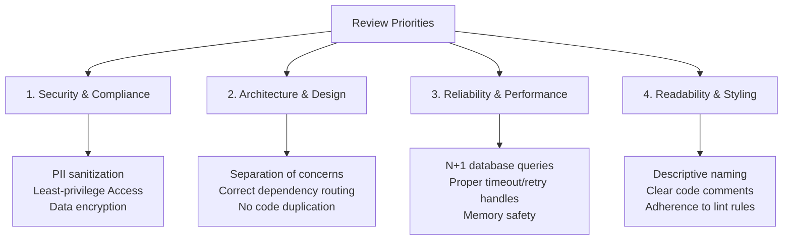

# Peer Review Guidelines

Peer reviews at Acadify Solution are a cornerstone of our software development lifecycle. They are not merely a gatekeeping step; they serve as our primary mechanism for knowledge sharing, cross-training, and maintaining system security and compliance.

We require at least **one (1) senior engineer approval** on all pull requests, and recommend **two (2)** for changes affecting database schemas, cloud infrastructure, or critical AI pipelines.

---

## ✍️ Author's Checklist: Before Requesting Review

As a PR author, it is your responsibility to ensure the PR is clean, readable, and ready for inspection. Complete the following self-audit before requesting reviewers:

### 1. Scope & Size

- **Keep it Focused:** The PR should address a single, logical issue or feature. If a task requires modifying multiple components, split the work into separate, smaller PRs.
- **Limit PR Size:** Aim for PRs under **400 lines of code changes** (excluding auto-generated code like DB migrations or dependency locks). Smaller PRs are reviewed faster and result in higher-quality feedback.

### 2. Verification

- **Compile & Lint:** Confirm the code compiles, lints, and formats cleanly locally.
- **Test Coverage:** Ensure all existing tests pass and new unit/integration tests cover your modifications. Check that coverage doesn't drop below the 80% baseline.
- **Provide Evidence:** Include CLI test runs, mock outputs, or browser screenshots in the Pull Request template description.

### 3. Cleanliness Check

- No leftover debug print statements (`print()`, `console.log()`), commented-out code blocks, or temporary scratch files.
- All environment variables or credentials are removed and stored in secret stores.

---

## 🔍 Reviewer's Checklist: What to Look For

Reviewers should evaluate the code based on the following prioritized categories:

### 1. Security & Compliance (Highest Priority)

- Is there any potential exposure of Protected Health Information (PHI) or personally identifiable information (PII)?
- Are inputs sanitized and queries parameterized (no SQL injection vectors)?
- Are authorization checks enforced at the entry points of new API endpoints?

### 2. Architecture & System Design

- Does this implementation adhere to our service boundary limits?
- Are dependencies flowing in the correct direction?
- Is there code duplication that should be abstracted into shared services?

### 3. Reliability & Performance

- Does this change introduce potential memory leaks or resource leaks (e.g., database connections left open, unclosed file descriptors)?
- Are database queries indexed properly? Review for potential N+1 query patterns.
- Are outbound service calls configured with reasonable timeouts and backoff strategies?

### 4. Readability & Maintainability

- Are variable, function, and class names descriptive of their intent?
- Is complex, non-obvious logic explained with concise, inline documentation?
- Are unit tests actually asserting correct behavior, including edge cases and failure paths?

---

## 💬 Reviewer SLAs & Resolving Disputes

### Reviewer Response SLA

We target a **24-hour response SLA** for initial reviews on pull requests. If you are assigned to a PR and cannot review it within this timeframe due to other priorities, notify the author immediately and re-assign the PR to another team member or back to the pool.

### Resolving Technical Disagreements

Disagreements on implementation patterns or design choices are natural.

1. **Avoid Comment Wars:** If a discussion on a PR goes back and forth for more than **3 comments** without resolution, stop commenting.
2. **Take it Synchronous:** The author and reviewer must jump on a quick huddle (Slack or Google Meet) to discuss the trade-offs.
3. **Escalation Path:** If an agreement cannot be reached during the call, escalate the discussion to the pod lead or the Engineering Director, who will make the final decision.
4. **Document the Outcome:** Once resolved, document the decision in the PR comments for future reference before merging.

---

## 💬 Code Review Etiquette & Feedback Severity

To keep reviews constructive and clear, we prefix comments with standard severity tags. This helps the author understand what needs to be fixed immediately versus what is optional.

| Prefix               | Meaning                                                 | Action Required                                                                                  | Example                                                                                                                           |
| :------------------- | :------------------------------------------------------ | :----------------------------------------------------------------------------------------------- | :-------------------------------------------------------------------------------------------------------------------------------- |
| 🛑 **`BLOCKER:`**    | Critical defect, security leak, or architectural error. | **Must be resolved** before the pull request can be merged.                                      | `BLOCKER: Outbound payload does not pass through the PII masking interceptor. This violates HIPAA compliance.`                    |
| ⚠️ **`SUGGESTION:`** | Alternative implementation path or optimization.        | **Recommended**, but the author has the final say.                                               | `SUGGESTION: We could use a Set lookup here instead of searching the array, changing runtime from O(N) to O(1).`                  |
| 💡 **`NIT:`**        | Small visual change, minor style preference, or typos.  | **Optional**. The author should address if simple, but doesn't block merge.                      | `NIT: Typo in the error log message: 'recieved' should be 'received'.`                                                            |
| ❓ **`QUESTION:`**   | Inquiry about design intent or logic.                   | **Required explanation**. Does not necessarily block merge unless the response reveals an issue. | `QUESTION: Why did we choose to cache this query result for 1 hour instead of 5 minutes? Are we concerned about stale user data?` |

---

## 🚥 Merging and Reversion Policies

### Who Merges?

- **The Author Merges:** Once all blocking comments are addressed, CI checks are green, and approvals are granted, the **author of the PR** executes the merge. This ensures the author controls deployment timing and is available to monitor the rollout.

### Reversion Policy

- **Revert First, Debug Later:** If a merged PR triggers a production degradation, crash, or compliance failure in the staging/production environments, the release manager or on-call engineer will **immediately revert the merge commit**.
- Do not try to "hotfix forward" on `main` unless the fix is trivial and can be verified in under 5 minutes. Reverting ensures system stability while the author investigates the issue locally on a separate branch.
