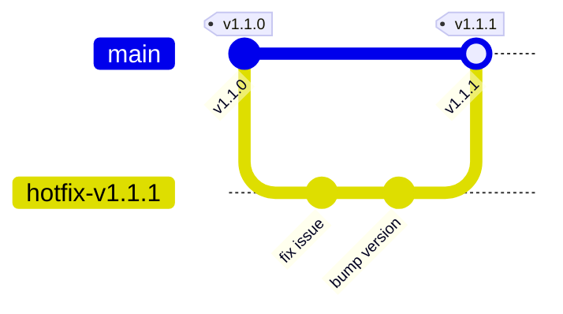

# Release & Version Management

This document defines Acadify Solution's release processes, versioning conventions, pre-release checklists, and hotfix guidelines. Our release strategy decouples deployment from feature releases using feature flags, enabling high-frequency continuous delivery while mitigating stability risks.

---

## 🔢 Versioning Standard: Semantic Versioning (SemVer)

All software components, APIs, libraries, and Docker images developed at Acadify Solution must adhere to **Semantic Versioning 2.0.0**.

The version format is: **`MAJOR.MINOR.PATCH`**

```text
  1.  0.  4
  │   │   │
  │   │   └─── PATCH: Backward-compatible bug fixes
  │   │
  │   └─────── MINOR: Backward-compatible feature additions
  │
  └─────────── MAJOR: Backward-incompatible API changes
```

### Bumping Logic and Rules

1. **PATCH Bumps (`x.y.Z`):** Increment the patch version for internal bug fixes, security dependency updates, packaging improvements, or documentation changes. These must not break existing interfaces.
2. **MINOR Bumps (`x.Y.z`):** Increment the minor version when adding new capabilities, new API endpoints, or database structures in a backward-compatible manner. Existing integrations must continue to work unchanged.
3. **MAJOR Bumps (`X.y.z`):** Increment the major version when introducing breaking API interface modifications, removing endpoints, changing schema structures without backward compatibility layers, or changing authorization models.

_Note: For pre-1.0.0 software (`0.y.z`), the API is considered unstable. Minor versions (`0.Y.z`) can contain breaking changes._

---

## 🎛️ Deployment vs. Release (Feature Flags)

At Acadify, **Deployment is a technical event** (moving code to production) while **Release is a business event** (making the feature visible to users).

### 1. Feature Flag Enforcement

- Any feature that takes longer than 3 days to develop or changes user-facing workflows must be wrapped in a feature flag (using LaunchDarkly, Unleash, or custom Firebase Remote Config layers).
- **Flag Cleanup SLA:** To prevent code debt, feature flag wrappers must be removed from the codebase within **30 days** of achieving 100% rollout. Open a cleanup chore task immediately following the release.

### 2. Canary Rollouts & Rollback Conditions

We roll out features to production incrementally:

1. **Stage 1:** Dogfooding (internal developers and QA) — 100% flag enabled for internal users.
2. **Stage 2:** Canary group — 5% of customer traffic. Monitor metrics for **24 hours**.
3. **Stage 3:** Expansion — incremental steps (25% -> 50% -> 100%).

- **Automatic Rollback Triggers:** Roll back the release automatically if the canary deployment causes:
  - An increase in the application error rate by `> 0.1%`.
  - A latency degradation at the 95th percentile (`p95`) of `> 100ms`.
  - CPU or memory spikes exceeding `80%` on container nodes.

---

## 📋 Pre-Release Checklist

Before promoting any release build to the staging or production environments, the release manager or lead engineer must verify this checklist:

### 1. Data Integrity & DB Migrations

- [ ] Database migration scripts ran successfully against a copy of production data in a dry-run staging sandbox.
- [ ] Verified migrations are non-blocking (e.g., no exclusive table locks or long-running index creations during peak hours).
- [ ] Rollback migrations have been tested and verified functional.

### 2. Compliance & Verification

- [ ] PII masking filters have been verified for compatibility against any new LLM model endpoints.
- [ ] Playwright E2E regression test suites have run and achieved 100% pass rates in the staging environment.
- [ ] Static dependency analysis shows no high or critical security alerts.

### 3. Documentation & Telemetry

- [ ] Internal API documentation (Swagger/OpenAPI, GraphQL schemas) is updated and published.
- [ ] Health-check and error logging dashboards (Sentry, Datadog) are configured with active alerts for the new version.

---

## 📝 Release Notes Template

Every production deployment must be accompanied by structured release notes in the repository's `CHANGELOG.md` file. Release notes must be written in professional, customer-facing language (clear value-add, no developer jargon).

### Template Format

```markdown
## [1.2.0] - 2026-06-21

### 🚀 Features

- **[ai-gateway]** Integrated custom PII masking interceptor for outbound Anthropic API requests.
- **[dashboard]** Added tenant-wide resource billing breakdowns.

### 🐛 Bug Fixes

- **[auth]** Resolved clock skew token validation error on the zero-trust secure proxy.
- **[db]** Fixed index lock contention issue during customer session writes.

### 🔒 Security & Compliance

- **[compliance]** Enabled database table column encryption for SOC2/HIPAA compliance targets.

### ⚙️ DevOps & Infrastructure

- **[iac]** Migrated RDS postgres configuration to Terraform module version 5.0.0.
```

---

## 🚨 Hotfix Management Policy

A hotfix is an emergency release bypass meant to resolve active production degradations, high-severity security vulnerabilities, or major compliance breaches.



### Hotfix Protocol

1. **Branching:** Branch directly from the latest release tag or `main` state (e.g., `hotfix/issue-description`).
2. **Strict Scope:** A hotfix branch must **only** contain code fixing the immediate critical defect. Do not slip other features or unrelated refactors into a hotfix.
3. **Review Bypass:** Hotfixes require a senior engineer review, but can bypass queue times. The PR should be pinned in team communication channels for immediate attention.
4. **Tagging and Merging:** Once verified in staging, merge the hotfix branch back to `main` (and cherry-pick into release branches if applicable) and immediately tag the release (e.g., `v1.1.1`).
5. **Post-Mortem:** Every hotfix requires a brief post-mortem session within 48 hours to identify the root cause and prevent similar issues.
